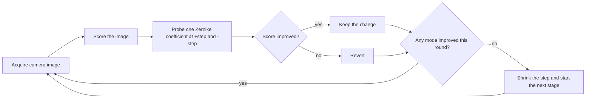

# Sensorless adaptive optics for an optical tweezer setup

Wavefront correction with coordinate descent. Python code I wrote for my master's thesis to correct the aberrations a laser beam picks up along its optical path.

Instead of measuring the wavefront with a dedicated wavefront sensor, the code scores a camera image of the focal spot with a metric. It then adjusts Zernike coefficients on a spatial light modulator (SLM) using coordinate descent, until the spot is tighter and centered on its target.

## Why this problem

Optical tweezers need a tightly focused, well-centered spot. Imperfect optics along the beam path distort the wavefront, which broadens the focus and lowers its peak intensity. Zernike polynomials are a standard basis for describing these distortions, so correction reduces to finding a small set of coefficients for the SLM to apply.

A sensorless approach needs no wavefront sensor and no analytic model of the setup. The camera image of the focal spot is the only feedback, and the optimizer works directly on a metric computed from measured images.

## How it works



The optimizer is coordinate descent over the Zernike coefficients. It improves one coefficient at a time, tries a positive and a negative step for each mode, and keeps whichever lowers the loss. It uses only metric evaluations, never gradients. When no mode improves, the step size is divided by a decay rate (default 1.8) and the next stage begins. The defaults are 5 stages with up to 100 steps per stage.

There are two optimization routines:

- **Focus:** adjusts defocus-related coefficients to optimize a focus objective. The default objective is the area of the spot above half of its maximum intensity.
- **Position:** adjusts tip and tilt (Zernike modes (1,-1) and (1,1)) so the spot lands on a target pixel. The loss is the Dice overlap between the measured image and a generated Airy or Gaussian reference spot.

### Objective functions

| Type | Options |
|---|---|
| Image quality | thresholded area, standard deviation, kurtosis, Laplacian sharpness, local variance |
| Image comparison | MSE, MAE, PSNR, SSIM, Dice, KL divergence, cumulative-distribution distance |

## Hardware and scope

This is experiment code, not a general-purpose package. Running the optimizers needs:

- an SLM that can apply Zernike phase patterns
- a focusing lens and a camera imaging the focal spot
- the control library behind the `commander` object, which exposes camera frames and Zernike coefficients

Without that setup the optimizers cannot run. The repository does not include recorded before and after images, so it makes no performance claim. It is best read as a worked example of sensorless adaptive optics on a real optical system.

## What I built

Most of this code is my own work, written as a first attempt at the problem during my thesis:

- The staged coordinate descent optimizer for focus and position
- The objective functions, covering both image-quality and image-comparison measures
- Airy and Gaussian reference-image generation
- Image analysis helpers for spot center and radius
- Thread-safe access to the shared hardware controller

## Known rough edges

- The probing logic is repeated for each mode instead of looped over a list of modes
- Several values (target pixel, thresholds, reference intensity) are hard-coded for my setup
- There are no automated tests, and some experimental helper code is still in `main.py`

## Planned: a hardware-free demo

A simulated SLM and camera (random Zernike aberrations applied to a Gaussian beam, with the focal plane computed by FFT) so the optimizer can be run and benchmarked on any machine. Results from it will be labelled as simulated.

## Repository layout

```
advanced_slm/
    Airy.py         Airy-disk and Gaussian reference profiles
    Img.py          image reading, plotting, spot center and radius estimates
    Zernike.py      helpers to read, set, add to and reset Zernike coefficients
    main.py         objective functions and the focus and position optimizers
    Optimizer.py    alternate optimization routines
```

Python 3 with numpy, scipy, matplotlib and scikit-image.

## Author

Saloni Chourasiya, physicist working on machine learning and scientific computing.


