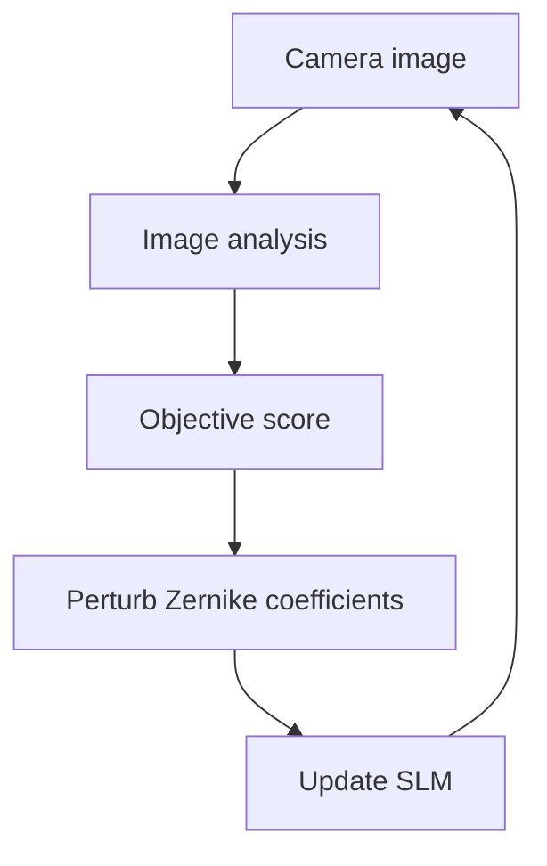

# Image-Guided Wavefront Correction

I developed Python routines for **image-based feedback and
coordinate-descent optimization** to correct wavefront aberrations using
a spatial light modulator (SLM), with the goal of improving optical
imaging quality.

## Result

**Line-pair resolution: 550 → 600 lp/mm (+9.1%)** after wavefront
optimization, as reported in my thesis, Chapter 4, Section 4.4.1.

*The result is reported from the experimental work described in the
thesis; a reproducible, hardware-independent benchmark is not yet
included in this repository.*

```{=html}
<!-- Add one verified, cropped result figure here, for example:

-->
```
## How it works

1.  Acquire an image from the camera or load an image for offline
    analysis.
2.  Calculate image-quality measurements and an objective score.
3.  Perturb selected Zernike coefficients and measure the score again.
4.  Keep updates that improve the objective; reduce the step size as
    optimization progresses.
5.  Plot and save measurements to inspect the result.



## What I built

-   Image-analysis helpers for visualization, intensity-based centre
    estimation, and spot-size measurements.
-   Image-quality and comparison metrics, including MSE, MAE, PSNR,
    SSIM, and additional focus measures.
-   Iterative optimization routines that compare parameter perturbations
    and adjust step sizes.
-   Helpers for managing Zernike coefficients and generating idealized
    Airy-disk and Gaussian reference profiles.
-   Integration points for camera/SLM control through the experimental
    controller interface.

## How to run

The original workflow depends on experiment-specific hardware and local
controller libraries. A small offline demo using saved images, without
physical camera or SLM hardware, is planned; portable run instructions
will be added with it.


